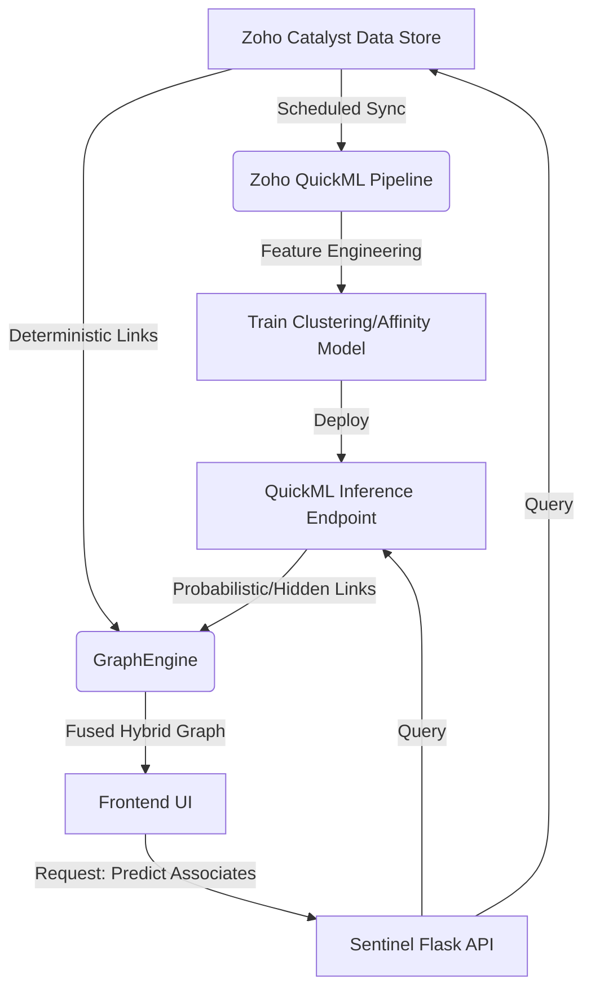

# Phase 2: QuickML Affinity - Understanding Plan

## 1. Introduction: The Need for an "AI Brain"
We are embarking on **Phase 2: QuickML Affinity**. Currently, our Sentinel AI Graph Engine is highly deterministic. If Suspect A and Suspect B share a phone number or an FIR, the graph shows a link. But what if Suspect A and Suspect C have never communicated directly, yet they operate in the exact same jurisdiction, use the same Modus Operandi (MO), target the same demographic, and are active during the same hours? 

Deterministic graphs miss these "ghost links." This is where **Zoho QuickML Affinity** comes in. By training ML models (Clustering, Link Prediction, or Similarity Scoring) on our structured ZCQL case data, we can predict hidden syndicates and preemptively flag high-risk associations before a crime officially connects them.

---

## 2. Advantages & Disadvantages

### Advantages (The "Why It's Great")
*   **Predictive Policing:** Shifts the system from *reactive* (visualizing past crimes) to *proactive* (predicting future associations).
*   **Hidden Link Discovery:** Identifies "ghost" connections based on behavioral affinity (MO, location, time, weapon choice) rather than direct hard evidence (phone calls).
*   **Automated Risk Scoring:** Suspects can be assigned a dynamic "Affinity Risk Score" based on their proximity to known kingpins in the high-dimensional QuickML vector space.
*   **Resource Optimization:** Directs investigative resources toward high-probability targets instead of chasing dead ends.

### Disadvantages (The "What to Watch Out For")
*   **False Positives & Bias:** Machine Learning models can hallucinate connections or exhibit bias based on historical data. A predicted link is *not* legal evidence.
*   **Latency & Compute Cost:** Running real-time inference on a massive graph can be computationally expensive and may introduce latency compared to simple ZCQL SQL queries.
*   **Model Drift:** Criminal tactics evolve. An ML model trained on 2024 data might miss the cyber-fraud tactics of 2026. The model requires continuous retraining (MLOps pipeline).
*   **Explainability:** If an officer asks, "Why are these two people linked?", a deterministic graph says "Shared FIR-123". An ML model might say "78% cosine similarity," which is hard to present in court.

---

## 3. Storytelling: How This Helps the Project

Imagine Inspector Vikram sitting at his desk at the Koramangala Police Station. A string of high-end vehicle thefts has occurred over the last month. Our current **Phase 1 Graph** shows Vikram all the known associates of a recently arrested car thief, Ramesh. 

Vikram intercepts Ramesh's phone, but Ramesh has been careful—he uses burner phones and hasn't called his fencing network. The trail goes cold. The Phase 1 Graph has hit a dead end because there is no *hard data* linking Ramesh to anyone else.

**Enter Phase 2: QuickML Affinity.**
Vikram clicks "Generate AI Affinity Predictions." The system securely sends Ramesh's behavioral profile (Target: SUVs, MO: Keyless repeater attacks, Time: 2 AM - 4 AM) to Zoho QuickML. The model scans thousands of unsolved cases and existing suspect dossiers. 

Within seconds, the graph updates with a dashed, glowing line indicating a **Predicted Link (89% Confidence)** between Ramesh and an interstate chop-shop operator named Praveen in Belagavi. They have no shared FIRs, no shared phones. But the ML model recognized that Praveen's chop-shop specializes in the exact makes/models stolen in Koramangala during those specific hours.

Vikram issues a surveillance request on Praveen. Two days later, a stolen Koramangala SUV is intercepted entering Praveen's garage. 

**The Impact:** We have transformed Sentinel AI from a simple visualizer into an active AI detective that finds the needle in the haystack when human intuition hits a wall.

---

## 4. System Design Architecture (Phase 2)

If we implement QuickML Affinity, the architecture will evolve into a hybrid **Deterministic + Probabilistic** engine.

### The Flow
1.  **Data Extraction:** A background CRON job extracts sanitized dossier and FIR data from **Catalyst Data Store (ZCQL)**.
2.  **Model Training (Offline):** The data is fed into **Zoho QuickML**. We train a Clustering algorithm (e.g., K-Means on MO/Location) or a Similarity Model (Cosine distance between suspect feature vectors).
3.  **Inference API (Online):** When a user requests an "Affinity Prediction" in the Sentinel UI, the `GraphEngine` queries the QuickML Endpoint via the `ZohoQuickMLProvider`.
4.  **Graph Fusion:** The `GraphEngine` takes the deterministic nodes (Phase 1) and injects **Virtual Edges** (Predicted Links) returned by QuickML.
5.  **UI Rendering:** The frontend renders these virtual edges distinctly (e.g., dashed glowing lines) so officers know it is an AI prediction, not hard evidence.

### Architecture Diagram

---

## 5. Does this Gatekeep or Upgrade Existing Functionalities?

**Answer: It is a massive UPGRADE. It does NOT gatekeep.**

*   **Non-Destructive Overlap:** QuickML Affinity will be implemented as an *overlay* or an *additive layer*. The core deterministic graph (Phase 1) will always remain the foundational truth layer. If QuickML goes down, or if the officer turns off "AI Predictions," the system falls back seamlessly to the exact state it is in right now.
*   **Opt-In Intelligence:** We will design the UI so that AI-predicted links are toggled via a button (e.g., `[x] Show Predicted Affinities`). This ensures we do not pollute hard evidence with probabilistic guesses unless explicitly requested by the investigator.
*   **Interface Segregation:** By adhering to SOLID principles, we will create a new `I Predictor` interface or add a dedicated method to the `GraphEngine` (`inject_affinity_predictions()`). The existing `GraphAgent` will merely call this new method when the user asks a predictive question (e.g., "Who *might* be working with Ramesh?"). 

**Conclusion:** Phase 2 is a strict enhancement that respects the boundaries of Phase 1, upgrading the system from a descriptive tool to a predictive weapon.
