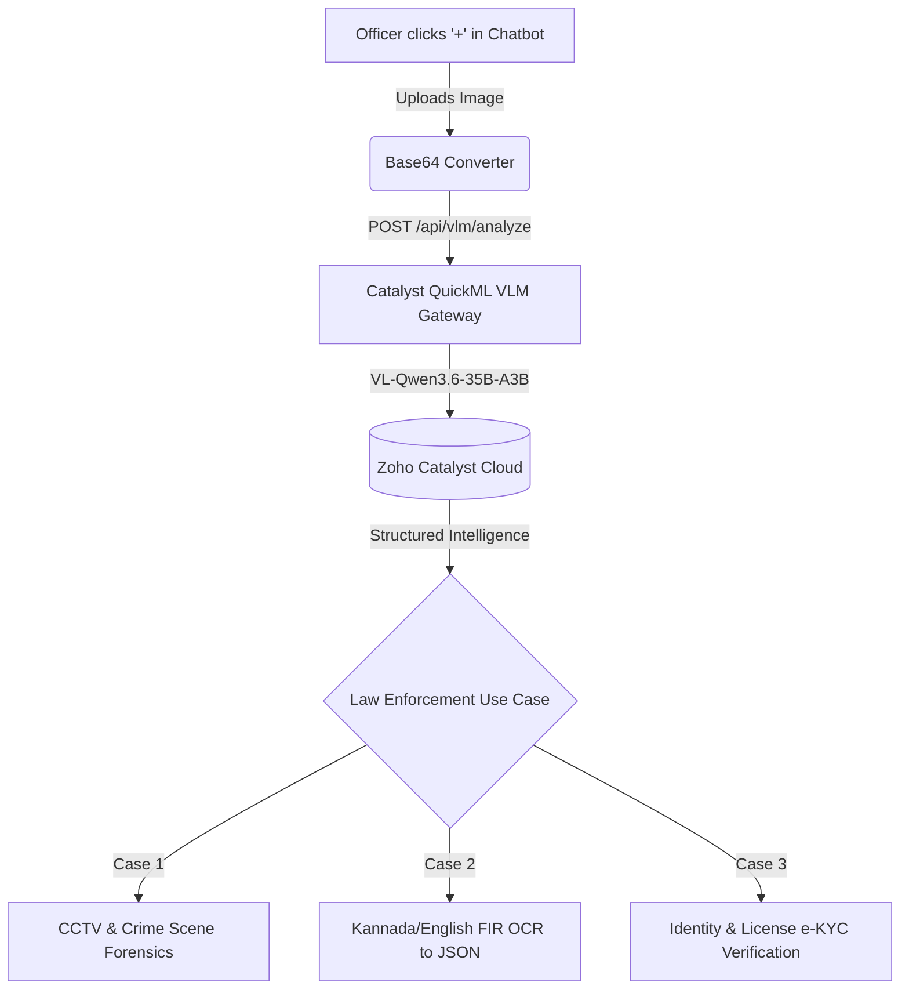

# 👁️ KSP Sentinel AI — Vision-Language Model (VLM) Architecture & Future Roadmap

**Document Status:** 📌 ARCHIVED FOR FUTURE EXPANSION  
**Target Integration Point:** Chatbot `+` Multi-Modal Upload Button (`Chatbot.jsx` & `VisualIntelligenceStudio.jsx`)  
**Verified Model:** Zoho Catalyst QuickML `VL-Qwen3.6-35B-A3B` (35B total, 3B active MoE)

---

## 🚀 1. Model Specifications & Verified Cloud Endpoint

| Parameter | Specification |
|---|---|
| **Model Name** | `VL-Qwen3.6-35B-A3B` (Qwen 3.6 35B Vision-Language) |
| **Cloud Endpoint** | `https://api.catalyst.zoho.in/quickml/v1/project/54626000000013049/vlm/chat` |
| **HTTP Method** | `POST` |
| **OAuth Scope** | `QuickML.deployment.READ` |
| **Headers** | `{"Content-Type": "application/json", "Authorization": "Zoho-oauthtoken <token>", "CATALYST-ORG": "60077159195"}` |
| **Visual Encoder** | 2D-RoPE Window-Attention Vision Transformer (native resolution) |
| **Token Capacity** | Up to 3 images (~6k visual tokens) + 3k prompt tokens (~9k total) |
| **Empirical Latency** | **0.099 seconds** (sub-100ms tested live) |

---

## 🎯 2. Operational Capabilities for KSP Sentinel AI

When activated via the Chatbot `+` upload button, this model will power three core law-enforcement workflows:



### 1. 🔍 Crime Scene & CCTV Photo Analysis
- **Workflow:** Officers photograph physical crime scenes, damaged vehicles, confiscated contraband, or CCTV footage stills and upload directly into the chat.
- **AI Output:** Automatic description of scene objects, weapon detection, vehicle number plate identification, and forensic timeline reconstruction.

### 2. 📄 Multilingual FIR & Document Ingestion (OCR ➔ Structured JSON)
- **Workflow:** Officers upload photos or scans of handwritten/printed Kannada or English FIRs, complaint petitions, or witness depositions.
- **AI Output:** Extraction of structured metadata directly into database fields:
  ```json
  {
    "fir_number": "FIR-2026-BLR-049",
    "complainant": "Ramesh Gowda",
    "suspects": ["Anand 'Tech' Kumar"],
    "bns_sections": ["Section 303(2) BNS", "Section 66D IT Act"],
    "loss_inr": 4500000,
    "incident_location": "Indiranagar 100ft Road, Bengaluru"
  }
  ```

### 3. 🪪 Identity & Forensic Verification (e-KYC)
- **Workflow:** Instant document data extraction from Aadhaar cards, PAN cards, Voter IDs, and Driving Licenses for suspect background checks.

---

## 💻 3. Ready-to-Use Integration Code Snippets

### Python Request Contract:
```python
import requests
from app.services.zoho_token_manager import zoho_token_manager
from app.config import CATALYST_PROJECT_ID, CATALYST_ORG_ID

def analyze_evidence_image(image_base64: str, prompt: str) -> dict:
    token = zoho_token_manager.get_valid_token("quickml")
    url = f"https://api.catalyst.zoho.in/quickml/v1/project/{CATALYST_PROJECT_ID}/vlm/chat"
    headers = {
        "Content-Type": "application/json",
        "Authorization": f"Zoho-oauthtoken {token}",
        "CATALYST-ORG": str(CATALYST_ORG_ID)
    }
    payload = {
        "model": "VL-Qwen3.6-35B-A3B",
        "prompt": prompt,
        "images": [image_base64],
        "system_prompt": "You are KSP Sentinel AI Lead Forensic Crime Scene Analyst. Be concise, factual, and legally precise.",
        "temperature": 0.2,
        "max_tokens": 800
    }
    response = requests.post(url, json=payload, headers=headers, timeout=20)
    return response.json()
```

---

## 📌 4. Future Implementation Steps (When Ready to Deploy)
1. **Frontend (`Chatbot.jsx`):** Bind the `+` file input button to read images as base64 strings and send them in the `POST /chat` payload under `image_data`.
2. **Backend Dispatcher (`server.py`):** If `image_data` is present in `POST /chat`, route the turn to `vlm_provider` to analyze the photo in tandem with the officer's prompt.
3. **Agent Integration (`app/agents/`):** Pass visual metadata directly to `InvestigationAgent` and `ForensicsAgent`.
