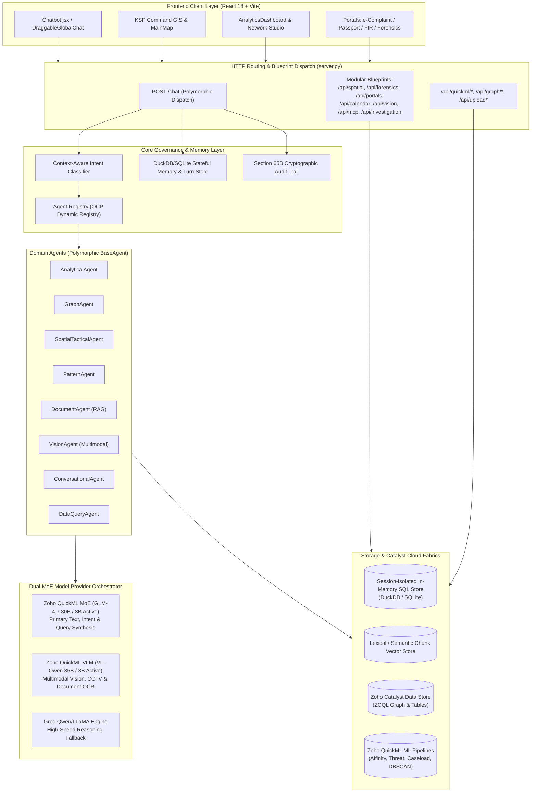

Listed directory rohith_project
Listed directory backend
Listed directory app
Listed directory agents
Listed directory blueprints
Listed directory core
Listed directory engine
Listed directory providers
Listed directory services
Listed directory src
Listed directory components
Listed directory services
Viewed server.py:1-250
Viewed server.py:251-500
Viewed server.py:501-750
Viewed server.py:751-926
Viewed calendar.py:1-239
Viewed forensics.py:1-262
Viewed investigation.py:1-117
Viewed mcp_social.py:1-149
Viewed portals.py:1-211
Viewed spatial.py:1-349
Viewed vision.py:1-147
Viewed bootstrap.py:1-32
Viewed interfaces.py:1-189
Viewed orchestrator.py:1-222
Viewed quickml_service.py:1-160
Viewed session_store.py:1-150
Viewed graph_engine.py:1-140
Viewed apiClient.js:1-46
Viewed App.jsx:1-150
Viewed App.jsx:151-300

# Comprehensive Codebase Analysis: `rohith_project` (KSP Sentinel AI)

---

## 1. System Design & Architectural Topology

`rohith_project` is an enterprise-grade AI and analytics backend built for the Karnataka State Police (KSP) Sentinel AI command infrastructure. It is designed to deploy seamlessly on **Zoho Catalyst AppSail / Serverless Cloud** and run locally with zero-configuration fallbacks.



---

## 2. Routes & Logic Artifacts

Below is the complete catalog of all API routes, input/output contracts, and internal business logic across [server.py](file:///d:/latest_datathon/rohith_project/server.py) and the modular blueprints in [`app/blueprints/`](file:///d:/latest_datathon/rohith_project/app/blueprints).

### A. Core Polymorphic Chat & File Ingestion

| Endpoint | Method | Input Contract | Output Contract | Internal Logic & Adapters |
| :--- | :---: | :--- | :--- | :--- |
| **`/chat`** | `POST` | `{ query, session_id, division, officer_id, fir_number, context_injection }` | `AgentResponse` JSON: `{ success, answer, agent_type, agent_label, agent_icon, charts, executive_decision, provider, visuals_updated, suggested_actions }` | 1. Retrieves historical session turns & memory summary from [memory.py](file:///d:/latest_datathon/rohith_project/app/core/memory.py).<br>2. [classifier.py](file:///d:/latest_datathon/rohith_project/app/core/classifier.py) executes context-aware classification.<br>3. Intercepts operational guardrails.<br>4. Resolves agent via [registry.py](file:///d:/latest_datathon/rohith_project/app/core/registry.py) and executes [BaseAgent](file:///d:/latest_datathon/rohith_project/app/core/interfaces.py).<br>5. Supports Chain of Responsibility delegation.<br>6. Persists turns & generates Section 65B SHA-256 audit log. |
| **`/api/upload_dataset`**<br>**`/api/upload_document`**<br>**`/api/upload`** | `POST` | `multipart/form-data`: `file`, `session_id`, `officer_id` | Tabular: `{ success, filename, row_count, columns, baseline_charts, kpis }`<br>Doc: `{ success, filename, chunk_count, file_size }` | Polymorphic file routing:<br>- Documents (`.pdf`, `.docx`, `.txt`, `.md`) $\rightarrow$ [document_store.py](file:///d:/latest_datathon/rohith_project/app/engine/document_store.py) parses text into chunks.<br>- Data (`.csv`, `.json`, `.xlsx`) $\rightarrow$ [session_store.py](file:///d:/latest_datathon/rohith_project/app/engine/session_store.py) creates session table & generates auto-visualizations via [visual_intelligence.py](file:///d:/latest_datathon/rohith_project/app/engine/visual_intelligence.py). |
| **`/api/datasets`** | `GET` | Query params: `session_id` | `{ success, session_id, documents, tabular_tables, has_tabular_dataset, has_documents }` | Queries [document_store.py](file:///d:/latest_datathon/rohith_project/app/engine/document_store.py) and [session_store.py](file:///d:/latest_datathon/rohith_project/app/engine/session_store.py) for active session state. |
| **`/api/datasets/<filename>`** | `DELETE` | Path: `filename`, Query: `session_id` | `{ success, message }` | Purges documents or dropped tables from the active session store. |
| **`/api/rag_search`** | `POST` | `{ query, session_id, limit }` | `{ success, query, count, results: [{ chunk_id, doc_name, content, score }] }` | Executes ranked TF-IDF/lexical search across ingested document chunks. |
| **`/api/connect_database`** | `POST` | `{ db_type, connection_uri, table_name, session_id }` | `{ success, table_name, columns, row_count }` | Attaches a live relational database (MySQL, PostgreSQL) into session virtual tables. |

---

### B. Graph Intelligence & QuickML AI Inference Endpoints

| Endpoint | Method | Input Contract | Output Contract | Internal Logic & Adapters |
| :--- | :---: | :--- | :--- | :--- |
| **`/api/network_graph`** | `GET` / `POST` | `{ session_id, zcql_query, limit, include_topology }` | `{ success, source, total_records, god_nodes, nodes, edges, node_count, edge_count }` | [graph_engine.py](file:///d:/latest_datathon/rohith_project/app/engine/graph_engine.py):<br>1. Ingests raw ZCQL or uploaded session dataset.<br>2. Builds bipartite Star/Clique canonical graphs.<br>3. Computes degree centrality to isolate **God Nodes** (syndicate bosses, burner SIM pivots). |
| **`/api/graph/path`** | `GET` / `POST` | `{ start, target }` | `{ success, start, target, result: { path_found, path, total_hops, relations } }` | Executes bidirectional $O(V+E)$ Breadth-First Search (BFS) to find the shortest nexus between any two entities. |
| **`/api/graph/affinity`** | `GET` / `POST` | `{ suspects: Optional[List] }` | `{ success, node_count, edge_count, ai_predictions_count, syndicate_clusters, nodes, edges }` | Fuses factual ZCQL relationship topology with QuickML Behavioral Affinity predictions. |
| **`/api/quickml/predict_affinity`** | `POST` | `{ suspect_id, primary_crime_category, modus_operandi, operating_district, ... }` | `{ predicted_cluster, confidence, status, source, explanation, features_used }` | Invokes Catalyst QuickML Affinity Clustering Pipeline via [quickml_service.py](file:///d:/latest_datathon/rohith_project/app/services/quickml_service.py) with OAuth token injection and fallback heuristics. |
| **`/api/quickml/predict_caseload`** | `POST` | `{ crime_year, crime_month, crime_category, crime_subcategory }` | `{ predicted_case_count, confidence, status, source, explanation }` | Invokes QuickML Crime Statistics Regression Pipeline. |
| **`/api/quickml/predict_threat`** | `POST` | `{ case_id, incident_date, crime_type, latitude, longitude, police_station, financial_loss_inr }` | `{ threat_level, likelihood_score, status, source, explanation }` | Invokes QuickML Tactical Threat AutoML Classification Pipeline. |
| **`/api/quickml/predict_hotspot`** | `POST` | `{ latitude, longitude, severity_weight }` | `{ cluster_id, is_hotspot, confidence, status, source, explanation }` | Invokes QuickML Geospatial DBSCAN Clustering Pipeline. |
| **`/api/admin/trigger_retraining`** | `POST` | Header: `Authorization: Bearer <KSP_ADMIN_KEY>` | `{ success, message }` | Webhook triggered on schema drift to asynchronously initiate retraining across all 4 QuickML pipelines. |

---

### C. Specialized Domain Blueprints

| Blueprint / File | Route | Method | Purpose & Internal Logic |
| :--- | :--- | :---: | :--- |
| **[vision.py](file:///d:/latest_datathon/rohith_project/app/blueprints/vision.py)** | `/api/vision/analyze`<br>`/api/vision/ocr_fir`<br>`/api/vision/cctv_reconstruction` | `POST` | Extracts base64 images from multipart or JSON; dispatches prompts to `VL-Qwen3.6-35B-A3B` via [vision_agent.py](file:///d:/latest_datathon/rohith_project/app/agents/vision_agent.py) for scene reconstruction, weapon detection, and FIR OCR. |
| **[forensics.py](file:///d:/latest_datathon/rohith_project/app/blueprints/forensics.py)** | `/api/audio_transcribe_and_stage`<br>`/api/audio_staged/<session_id>`<br>`/api/audio_confirm_inject`<br>`/api/mule_trail` | `POST`<br>`GET`<br>`POST`<br>`POST` | **Human-in-the-Loop Forensics**: Transcribes Kannada/English audio statements via [cloud_stt_service.py](file:///d:/latest_datathon/rohith_project/app/services/cloud_stt_service.py), maps statutory BNS sections via [forensic_legal_mapper.py](file:///d:/latest_datathon/rohith_project/app/services/forensic_legal_mapper.py), stages for officer review, and injects into RAG on confirmation. Produces financial mule transaction graphs. |
| **[spatial.py](file:///d:/latest_datathon/rohith_project/app/blueprints/spatial.py)** | `/api/spatial/clusters`<br>`/api/spatial/heatmap`<br>`/api/spatial/dataset/upload`<br>`/api/spatial/active_layers` | `GET`/`POST`<br>`POST`<br>`GET` | Executes Haversine DBSCAN spatial clustering, produces weighted `[lat, lon, intensity]` heatmaps, and manages multi-layer uploads (GeoJSON, KML, CSV). |
| **[portals.py](file:///d:/latest_datathon/rohith_project/app/blueprints/portals.py)** | `/api/complaints`<br>`/api/passports`<br>`/api/passports/<id>/status`<br>`/api/police_firs` | `GET`/`POST`<br>`PUT` | Handles citizen e-Complaints, Passport Verification field checks, and Police-Initiated FIR records with dual-write to Catalyst Cloud Scale Data Store and local in-memory fallback. |
| **[calendar.py](file:///d:/latest_datathon/rohith_project/app/blueprints/calendar.py)** | `/api/calendar/events`<br>`/api/calendar/divisions`<br>`/api/calendar/summary` | `GET`/`POST`<br>`GET` | Tracks duty rosters, high-priority Section 66D court hearings, and anti-drug night patrol rosters across KSP divisions. |
| **[investigation.py](file:///d:/latest_datathon/rohith_project/app/blueprints/investigation.py)** | `/api/investigation/init`<br>`/api/investigation/chat`<br>`/api/investigation/tickets`<br>`/api/investigation/suspects` | `POST`<br>`GET` | Handles the direct handoff from GIS Map hotspot clicks into stateful AI investigation chat sessions, integrating Zoho Desk tickets and CRM suspect dossiers. |
| **[mcp_social.py](file:///d:/latest_datathon/rohith_project/app/blueprints/mcp_social.py)** | `/api/mcp/social_feed`<br>`/api/mcp/fetch_live`<br>`/api/mcp/publish_tag`<br>`/api/mcp/summarize` | `GET`<br>`POST` | Model Context Protocol (MCP) OSINT monitoring: aggregates Twitter/X, Instagram, and YouTube citizen alerts and produces 1-sentence summaries for the Control Room. |

---

## 3. End-to-End Component Storytelling

### Story 1: An Officer Queries Crime Trends via Chatbot UI
```text
[Citizen / Officer Input in Chatbot.jsx]
   │
   ▼
1. User enters: "Show cyber extortion trends in Bengaluru for 2025"
   │  Browser dispatches POST /chat (apiClient.js)
   ▼
2. Flask server.py receives request -> extracts session_id and user_query
   │  Delegates to MemoryAgent.get_session_history()
   ▼
3. classifier.py evaluates intent using GLM-4.7 / Groq Fast Reasoning
   │  Classifies query as [ANALYTICAL]
   ▼
4. registry.py resolves AnalyticalAgent
   │  AnalyticalAgent constructs SQL query against SQLite/DuckDB session_store
   │  Executes: SELECT month, count(*) FROM crime_dataset WHERE category LIKE '%Cyber%' GROUP BY month
   ▼
5. VisualSuiteBuilder transforms SQL result rows into Chart.js JSON structures
   │  Generates line chart & KPI metric cards
   ▼
6. GLM-4.7 synthesized executive briefing + statutory IPC/BNS observations
   │  Persists turns to DuckDB Turn Store
   │  AuditLogger appends Section 65B SHA-256 hash log
   ▼
7. Chatbot.jsx receives JSON response:
   - Displays markdown response
   - Renders interactive Chart.js line graph
   - Updates Executive Decision and Suggested Actions badges
```

---

### Story 2: Forensic Audio Ingestion & Section 65B Staging
```text
[Officer records Kannada voice statement on mobile / web]
   │
   ▼
1. AudioForensicsPanel.jsx uploads recording via POST /api/audio_transcribe_and_stage
   │
   ▼
2. forensics.py validates file extension & size (<15MB)
   │  Calls cloud_stt_service.py -> streams audio to Zoho Zia Speech / Sarvam AI
   │  Receives verbatim Kannada transcription
   ▼
3. forensic_legal_mapper.py translates Kannada -> English
   │  Extracts entities: Suspects, Bank Accounts, Locations
   │  Maps statutory offenses: BNS Section 318(4) (Cheating) / Section 66D IT Act
   ▼
4. document_store.py stores record in staged_transcripts sandbox
   │  Returns stage_id with preview to the frontend
   ▼
5. Officer reviews the transcript in the UI and clicks "Confirm & Index Evidence"
   │  POST /api/audio_confirm_inject
   ▼
6. document_store.py converts evidence into Markdown, computes chunk vectors, and saves to doc_chunks
   ▼
7. Chatbot DocumentAgent (RAG) is immediately able to cite the recording in subsequent queries
```

---

### Story 3: Geospatial Map Hotspot Click to AI Investigation Session
```text
[Commander clicks on a red high-density cluster on MainMap.jsx]
   │
   ▼
1. Map extracts cluster coordinates, FIR count, and crime categories
   │  Calls POST /api/investigation/init (portalClient.js)
   ▼
2. investigation.py creates stateful investigation session via session_service.py
   │  Pre-populates spatial context and calls agent_orchestrator.initialize_session_briefing()
   ▼
3. QuickML threat and affinity endpoints are called to fetch suspect criminal history
   │  Zoho Desk service queries priority field tickets
   ▼
4. Frontend automatically pops open DraggableGlobalChat with full briefing loaded
   │  Commander continues dialogue seamlessly: "Who are the linked suspects in this cluster?"
```

---

### Story 4: Live Relational Network Graph with God Node & Affinity Detection
```text
[Analyst opens Network Topology Studio]
   │
   ▼
1. VisualIntelligenceStudio.jsx requests GET /api/graph/affinity
   │
   ▼
2. server.py invokes GraphEngine.build_graph_from_zcql()
   │  Executes ZCQL query against Zoho Catalyst Data Store
   │  Normalizes records into canonical nodes (PERSON, VEHICLE, PHONE, FINANCIAL, CASE)
   ▼
3. GraphEngine computes degree centrality
   │  Identifies "God Nodes" (individuals or accounts linking 3+ disjoint FIRs)
   ▼
4. GraphEngine calls quickml_service.predict_suspect_affinity()
   │  Fuses predictive syndicate cluster edges on top of factual graph
   ▼
5. Frontend renders interactive Force-Directed Network Graph:
   - God Nodes highlighted with glowing rings
   - Factual links shown in solid lines
   - AI predictive syndicate ties shown in dashed gold lines
   - Clicking two nodes triggers POST /api/graph/path (Bidirectional BFS Shortest Path)
```