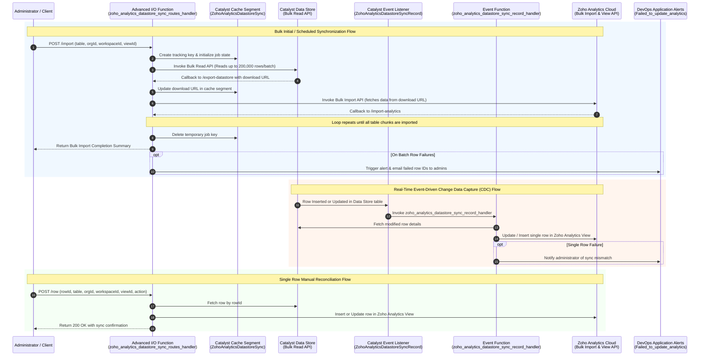
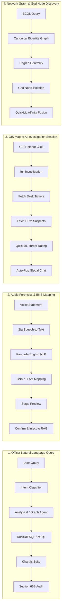

Viewed GLM_model_LLM.md:1-239
Viewed vison_language_LLM.md:1-110
Viewed filesystem_solution_architecture.md:1-192
Viewed intial_findings.md:1-251
Viewed review_pt.md
Listed directory app
Listed directory backend
Listed directory agents
Listed directory blueprints
Listed directory core
Listed directory engine
Listed directory providers
Listed directory services
Listed directory src
Listed directory components
Listed directory services
Viewed server.py:1-150
Viewed server.py:150-400
Viewed server.py:400-650
Viewed server.py:650-954
Viewed spatial.py:1-100
Viewed zoho_integration_service.py:1-150
Viewed zoho_integration_service.py:150-350
Viewed quickml_service.py:1-100
Viewed config.py:1-120

# System Architecture & Technical Specifications: `rohith_project` (KSP Sentinel AI)

---

## 1. Executive Role & Engineering Mindset

This system design document synthesizes the complete architectural blueprint, route catalog, Zoho Cloud service fabric, and the **Data Store $\leftrightarrow$ Analytics Sync CodeLib** pattern for the **Karnataka State Police (KSP) Sentinel AI** command platform.

### A. The Scofield Systems-First Mindset ([`scofield_prompt.md`](file:///d:/latest_datathon/rohith_project/review_prompt/scofield_prompt.md))
* **Analyze $\rightarrow$ Map $\rightarrow$ Design $\rightarrow$ Plan $\rightarrow$ Execute $\rightarrow$ Verify $\rightarrow$ Review:** Every change treats the existing codebase as ground truth.
* **Identify System Boundaries:** Explicitly define input contracts, state transformations, upstream dependencies, downstream consumers, and point-of-failure blast radiuses before modifying any module.
* **Token-Efficient Execution:** Maximum density of technical precision with zero meta-commentary or redundant boilerplate.
* **Evidence-Based Confidence Tagging:**
  * `[CERTAIN]`: Directly validated from code, ZCQL schemas, configuration, or official platform APIs.
  * `[LIKELY]`: Strongly inferred from architectural topology, requiring targeted validation.
  * `[ASSUMPTION]`: Unverified hypothesis requiring confirmation before committing.

### B. Principal Engineer Software Design Standards ([`coding_prompt.md`](file:///d:/latest_datathon/rohith_project/review_prompt/coding_prompt.md))
* **SOLID Architecture:**
  * **Single Responsibility (SRP):** Complete isolation between Routing (`blueprints/`), Domain Execution (`agents/`), Compute Engines (`engine/`), LLM Orchestration (`providers/`), and Cloud Integrations (`services/`).
  * **Open/Closed (OCP):** Open for new agent extensions via [`registry.py`](file:///d:/latest_datathon/rohith_project/app/core/registry.py) without modifying [`server.py`](file:///d:/latest_datathon/rohith_project/server.py).
  * **Liskov Substitution (LSP):** All domain agents inherit from [`BaseAgent`](file:///d:/latest_datathon/rohith_project/app/core/interfaces.py) and return uniform `AgentResponse` structures.
  * **Interface Segregation (ISP):** Repositories adhere to tight single-purpose interfaces (`IAuditRepository`, `ITicketRepository`, `ISuspectRepository`).
  * **Dependency Inversion (DIP):** Domain agents depend on abstract providers and interfaces rather than concrete cloud SDKs.
* **Anti-Spaghetti & Zero-Hardcoding Rule:** No inline SQL generation inside controllers, no scattered OAuth tokens, no hardcoded API keys; all configuration originates from [`app/config.py`](file:///d:/latest_datathon/rohith_project/app/config.py) and [`zoho_token_manager.py`](file:///d:/latest_datathon/rohith_project/app/services/zoho_token_manager.py).
* **Section 65B BSA 2023 Legal Compliance:** Cryptographic SHA-256 hash chaining applied to every turn, file ingestion, and dispatch operation.

---

## 2. Complete Codebase Structure

```
d:/latest_datathon/rohith_project/
├── server.py                               # Main Flask Application Gateway & Route Dispatcher
├── app-config.json                         # Zoho Catalyst AppSail Runtime Configuration
├── catalyst.json                           # Catalyst Project Resource Definition
├── Dockerfile                              # Containerized AppSail build manifest
├── requirements.txt                        # Python dependencies (DuckDB, Flask, Requests, etc.)
│
├── app/                                    # Core Application Package
│   ├── __init__.py
│   ├── config.py                           # Centralized configuration, endpoints, credentials & prompts
│   ├── bootstrap.py                        # Dynamic agent registration at startup (OCP)
│   │
│   ├── core/                               # System Core Governance & Orchestration
│   │   ├── interfaces.py                   # BaseAgent, AgentResponse, ExecutionContext contracts
│   │   ├── classifier.py                   # Context-aware LLM / Fast heuristic Intent Classifier
│   │   ├── registry.py                     # Dynamic Agent Registry (OCP pattern)
│   │   ├── router.py                       # Request routing & pipeline delegation
│   │   ├── memory.py                       # DuckDB / SQLite session turn store & compression
│   │   ├── audit.py                        # Section 65B SHA-256 tamper-evident hash logger
│   │   └── algorithms/                     # Core algorithmic routines (centrality, graph math)
│   │
│   ├── agents/                             # Polymorphic Domain Agents (LSP)
│   │   ├── analytical.py                   # SQL Crime Statistics & Trend Analysis Agent
│   │   ├── conversational.py               # General Police Operational Conversational Agent
│   │   ├── data_query.py                   # Structured Tabular Data Query Agent
│   │   ├── document.py                     # Document RAG & Procedural Knowledge Agent
│   │   ├── evidence.py                     # Forensic Evidence & Property Locker Agent
│   │   ├── federated.py                    # Multi-Source Intelligence Aggregation Agent
│   │   ├── graph.py                        # Syndicate Topology & God Node Graph Agent
│   │   ├── legal.py                        # BNS (Bharatiya Nyaya Sanhita) & IPC Legal Advisor
│   │   ├── pattern.py                      # Crime Pattern & Modus Operandi Detection Agent
│   │   ├── spatial.py                      # GIS Tactical Spatial & Patrol Optimization Agent
│   │   └── vision_agent.py                 # CCTV & Multimodal Scene Reconstruction Agent
│   │
│   ├── blueprints/                         # Modular Flask Blueprints (SRP)
│   │   ├── calendar.py                     # /api/calendar/* - Duty rosters, court hearings & patrols
│   │   ├── forensics.py                    # /api/audio_* & /api/mule_trail - Speech-to-Text & BNS mapping
│   │   ├── investigation.py                # /api/investigation/* - Map-to-Chat session handoff
│   │   ├── mcp_social.py                   # /api/mcp/* - Model Context Protocol OSINT alerts
│   │   ├── portals.py                      # /api/complaints, /api/passports, /api/police_firs
│   │   ├── spatial.py                      # /api/spatial/* - DBSCAN clustering, heatmaps, layers
│   │   └── vision.py                       # /api/vision/* - VLM scene analysis & FIR OCR
│   │
│   ├── engine/                             # High-Performance Analytical & Storage Engines
│   │   ├── analytics_engine.py             # Advanced statistical compute routines
│   │   ├── document_store.py               # In-memory TF-IDF / Lexical chunk vector index
│   │   ├── catalyst_document_store.py      # Cloud-native Catalyst Data Store RAG index
│   │   ├── graph_engine.py                 # Bipartite network builder, BFS paths, God Node centrality
│   │   ├── session_store.py                # Session-isolated DuckDB / SQLite virtual SQL engine
│   │   └── visual_intelligence.py          # Auto-generates Chart.js visualizations & KPI suites
│   │
│   ├── providers/                          # Decoupled AI Model Providers (DIP)
│   │   ├── base.py                         # BaseLLMProvider interface
│   │   ├── orchestrator.py                 # Dual-MoE Model Provider Orchestrator
│   │   ├── zoho_provider.py                # Zoho QuickML MoE GLM-4.7 (30B / 3B Active) Client
│   │   ├── zoho_vlm_provider.py            # Zoho QuickML VL-Qwen3.6-35B-A3B Multimodal Client
│   │   ├── groq_provider.py                # Groq Qwen/LLaMA ultra-fast fallback provider
│   │   └── vision_base.py                  # BaseVisionProvider interface
│   │
│   └── services/                           # Cloud Adapters & External Microservices
│       ├── agent_service.py                # High-level orchestration & session lifecycle
│       ├── catalyst_service.py             # Catalyst Data Store, Cache, File Store REST API adapter
│       ├── cloud_stt_service.py            # Zoho Zia / Sarvam Speech-to-Text adapter
│       ├── cloud_tts_service.py            # Zoho Zia Audio Synthesis adapter
│       ├── forensic_legal_mapper.py        # Kannada NLP, Entity Extraction & BNS/IT Act mapper
│       ├── quickml_service.py              # Adapter for 4 deployed QuickML ML Pipelines
│       ├── session_service.py              # Multi-turn state management & briefing synthesis
│       ├── spatial_analytics_service.py    # Haversine DBSCAN & kernel density heatmap compute
│       ├── spatial_ingestion_service.py    # CSV, KML, KMZ, GeoJSON multi-layer store
│       ├── zcql_graph_repository.py        # Catalyst Data Store ZCQL query adapter
│       ├── zoho_integration_service.py     # Repositories for Audit, Desk Tickets & CRM Suspects
│       ├── zoho_stt_service.py             # Dedicated Zia STT handler
│       └── zoho_token_manager.py           # Multi-badge OAuth token rotation & auto-refresh
│
├── review_prompt/                          # System Architecture & Prompt Specifications
│   ├── scofield_prompt.md                  # Systems-first structural engineering persona
│   ├── coding_prompt.md                    # Principal Software Engineer standards & clean code rules
│   ├── zoho_services.md                    # Zoho Cloud Ecosystem scope & reference links
│   ├── codelib-datastore-analytics-sync.md # Data Store to Analytics bulk/event sync architecture
│   ├── GLM_model_LLM.md                    # QuickML MoE GLM-4.7 API specification & contracts
│   ├── vison_language_LLM.md               # QuickML VLM VL-Qwen3.6-35B-A3B API specification
│   ├── filesystem_solution_architecture.md # AppSail read-only container analysis & persistence plan
│   ├── intial_findings.md                  # Comprehensive architectural overview of KSP Sentinel AI
│   ├── endpoints.md                        # Production QuickML ML pipeline endpoint URLs
│   └── review_pt.md                        # Architecture challenge prompt
│
└── src/                                    # Frontend Client Application (React 18 + Vite)
    ├── App.jsx                             # Main layout, tab navigation, and global state
    ├── index.css                           # High-contrast Cyber Sentinel Tactical Design System
    ├── components/
    │   ├── Chatbot.jsx                     # Primary multi-agent conversational interface
    │   ├── DraggableGlobalChat.jsx         # Context-preserving floating investigation chat modal
    │   ├── VisualIntelligenceStudio.jsx    # Interactive Force-Directed Graph & Chart studio
    │   ├── ComplaintPortal.jsx             # Public e-Complaint, Passport & FIR Portal
    │   ├── AudioForensicsPanel.jsx         # Voice statement recording, STT & Section 65B staging
    │   ├── UploadDatasetModal.jsx          # Dataset and Document drag-and-drop ingestion
    │   └── DatabaseConnectorModal.jsx      # Live MySQL / PostgreSQL enterprise DB connector
    └── services/
        ├── apiClient.js                    # Axios API client for /chat and upload endpoints
        ├── portalClient.js                 # API client for Portal and Investigation handoffs
        ├── pdfExportService.js             # Section 65B forensic dossier PDF export
        └── ttsService.js                   # Client-side audio playback adapter
```

---

## 3. Exhaustive API Route & Endpoint Catalog

### A. Core Gateway & Ingestion Endpoints ([`server.py`](file:///d:/latest_datathon/rohith_project/server.py))

| HTTP Method | Route | Request Payload / Params | Response Schema | Internal Execution Logic |
| :--- | :--- | :--- | :--- | :--- |
| `GET` | `/` / `/health` | None | `{ status, service, timestamp }` | Liveness probe for Zoho Catalyst AppSail & container orchestrators. |
| `GET` | `/api/health` | None | `{ status, architecture, zoho_catalyst, models, active_provider, registered_agents }` | Detailed diagnostics verifying Zoho OAuth credentials, active QuickML models, and agent registry status. |
| `POST` | `/chat` | `{ query: str, session_id: str, division: str, officer_id: str, fir_number: Optional[str], context_injection: Optional[dict] }` | `{ success: bool, answer: str, agent_type: str, agent_label: str, agent_icon: str, agent_color: str, charts: list, executive_decision: Optional[str], suggested_actions: list, visuals_updated: bool, data_available: bool, provider: str }` | **Polymorphic Agent Execution:**<br>1. Loads session history & memory summary from DuckDB [`memory.py`](file:///d:/latest_datathon/rohith_project/app/core/memory.py).<br>2. [`classifier.py`](file:///d:/latest_datathon/rohith_project/app/core/classifier.py) classifies intent (Analytical, Graph, Spatial, Pattern, Document, Vision, Legal, Conversational).<br>3. Intercepts operational guardrails.<br>4. Resolves agent via [`registry.py`](file:///d:/latest_datathon/rohith_project/app/core/registry.py) and executes [`BaseAgent.execute()`](file:///d:/latest_datathon/rohith_project/app/core/interfaces.py).<br>5. Supports Chain of Responsibility delegation.<br>6. Persists turn to DuckDB and commits SHA-256 Section 65B audit log. |
| `POST` | `/api/upload`<br>`/api/upload_dataset`<br>`/api/upload_document` | `multipart/form-data`: `file`, `session_id`, `officer_id` | Tabular: `{ success, filename, table_name, row_count, columns, baseline_charts, kpis }`<br>Document: `{ success, filename, chunk_count, file_size }` | **Polymorphic Ingestion Router:**<br>- Tabular (`.csv`, `.xlsx`, `.json`) $\rightarrow$ Ingests into session DuckDB table, runs [`VisualSuiteBuilder`](file:///d:/latest_datathon/rohith_project/app/engine/visual_intelligence.py) to generate baseline KPIs and Chart.js specs.<br>- Documents (`.pdf`, `.docx`, `.txt`, `.md`) $\rightarrow$ Ingests into [`document_store.py`](file:///d:/latest_datathon/rohith_project/app/engine/document_store.py), parses text chunks, builds lexical vector index. |
| `GET` | `/api/datasets` | `?session_id=<id>` | `{ success, session_id, documents, tabular_tables, has_tabular_dataset, has_documents }` | Retrieves list of all active tables and indexed documents in current session. |
| `DELETE` | `/api/datasets/<filename>` | Path param: `filename`, Query: `?session_id=<id>` | `{ success, message }` | Drops virtual table or deletes document chunks from session store. |
| `POST` | `/api/rag_search` | `{ query: str, session_id: str, limit: int }` | `{ success, query, count, results: [{ chunk_id, doc_name, content, score }] }` | Executes ranked lexical/TF-IDF similarity search against indexed document chunks. |
| `POST` | `/api/connect_database` | `{ db_type: "mysql"\|"postgres", connection_uri: str, table_name: str, session_id: str }` | `{ success, message, table_name, columns, row_count }` | Attaches external enterprise database into session DuckDB virtual schema. |
| `GET` | `/api/audit/logs` | `?limit=50` | `{ status, latest_hash, count, logs: [...] }` | Inspects recent cryptographic Section 65B audit trail entries from Catalyst NoSQL Data Store. |
| `GET` | `/api/audit/status` | None | `{ status, compliance, ledger_backend, table_id, latest_hash }` | Returns Section 65B compliance status and active table metadata (`54626000000152381`). |
| `POST` | `/api/admin/trigger_retraining` | Header: `Authorization: Bearer <KSP_ADMIN_KEY>` | `{ success, message }` | Schema-drift webhook triggering asynchronous retraining across all 4 QuickML pipelines. |

---

### B. Graph Intelligence & QuickML Inference Endpoints ([`server.py`](file:///d:/latest_datathon/rohith_project/server.py))

| HTTP Method | Route | Parameters / Payload | Output Contract | Internal Execution Logic |
| :--- | :--- | :--- | :--- | :--- |
| `GET` / `POST` | `/api/network_graph` | `?session_id=<id>&include_topology=true&limit=200` or `{ zcql_query }` | `{ success, source, total_records, god_nodes, nodes, edges, node_count, edge_count }` | Executes ZCQL against Catalyst Data Store (or queries local session DuckDB table), normalizes entities into canonical graph, and computes degree centrality to identify **God Nodes**. |
| `GET` / `POST` | `/api/graph/zcql` | `?query=<ZCQL_STRING>` or `{ query: str }` | `{ success, source, query, god_nodes, nodes, edges, node_count, edge_count }` | Executes arbitrary ZCQL statement against Catalyst Data Store and constructs topological graph JSON. |
| `GET` | `/api/graph/suspect/<id>` | Path: `suspect_id` | Graph JSON for suspect ego network | Queries all connected cases, phone numbers, vehicles, and associates for a given suspect. |
| `GET` | `/api/graph/case/<id>` | Path: `case_id` | Graph JSON for case ego network | Queries all suspects, evidence items, vehicles, and locations linked to an FIR. |
| `GET` / `POST` | `/api/graph/path` | `?start=<node1>&target=<node2>` | `{ success, start, target, result: { path_found, path, total_hops, relations } }` | Runs bidirectional Breadth-First Search (BFS) $O(V + E)$ to find the shortest relational nexus between two entities. |
| `GET` / `POST` | `/api/graph/affinity` | `{ suspects: Optional[list] }` | `{ success, node_count, edge_count, ai_predictions_count, syndicate_clusters, god_nodes, nodes, edges }` | Fuses factual ZCQL relational topology with QuickML Behavioral Affinity predictions (dashed predictive edges). |
| `POST` | `/api/quickml/predict_affinity` | `{ suspect_id, primary_crime_category, modus_operandi, operating_district, ... }` | `{ success, predicted_cluster, confidence, status, source, explanation, features_used }` | Dispatches payload to QuickML Suspect Affinity Clustering Pipeline with OAuth token injection and fallback heuristics. |
| `POST` | `/api/quickml/predict_caseload` | `{ crime_year: int, crime_month: str, crime_category: str, crime_subcategory: Optional[str] }` | `{ success, predicted_case_count, confidence, status, source, explanation, features_used }` | Dispatches payload to QuickML Crime Statistics Caseload Regression Pipeline (`ksp_Crimestatistics_5000_endpoint`). |
| `POST` | `/api/quickml/predict_threat` | `{ case_id, incident_date, crime_type, latitude, longitude, police_station, financial_loss_inr }` | `{ success, threat_level, likelihood_score, status, source, explanation, features_used }` | Dispatches payload to QuickML Tactical Threat AutoML Classification Pipeline. |
| `POST` | `/api/quickml/predict_hotspot` | `{ latitude: float, longitude: float, severity_weight: int }` | `{ success, cluster_id, is_hotspot, confidence, status, source, explanation }` | Dispatches coordinates to QuickML Geospatial DBSCAN Clustering Pipeline. |

---

### C. Specialized Domain Blueprints (`app/blueprints/`)

#### 1. Spatial Analytics Blueprint ([`spatial.py`](file:///d:/latest_datathon/rohith_project/app/blueprints/spatial.py))
* `GET / POST /api/spatial/clusters`: Computes Haversine DBSCAN clusters across active point layers; returns GeoJSON `FeatureCollection`.
* `GET / POST /api/spatial/heatmap`: Computes weighted density coordinates `[[lat, lon, intensity], ...]`.
* `POST /api/spatial/dataset/upload`: Ingests KML, KMZ, GeoJSON, CSV, or Excel geospatial files.
* `GET /api/spatial/datasets`: Lists all active/inactive spatial datasets.
* `GET /api/spatial/active_layers`: Combines all active boundary polygons and point layers into a unified GIS payload.
* `PATCH /api/spatial/dataset/<id>/toggle`: Toggles spatial layer visibility.
* `DELETE /api/spatial/dataset/<id>`: Removes spatial dataset.

#### 2. Forensics & Legal Mapping Blueprint ([`forensics.py`](file:///d:/latest_datathon/rohith_project/app/blueprints/forensics.py))
* `POST /api/audio_transcribe_and_stage`: Accepts audio recordings (`.wav`, `.mp3`, `.m4a`), dispatches to Zia STT, maps statutory BNS sections via [`forensic_legal_mapper.py`](file:///d:/latest_datathon/rohith_project/app/services/forensic_legal_mapper.py), and stages for officer verification.
* `GET /api/audio_staged/<session_id>`: Fetches staged transcripts awaiting officer confirmation.
* `POST /api/audio_confirm_inject`: Human-in-the-Loop confirmation: commits staged transcript to RAG document store.
* `POST /api/mule_trail`: Analyzes bank transactions to reconstruct multi-hop mule account laundering graphs.

#### 3. Investigation Handoff Blueprint ([`investigation.py`](file:///d:/latest_datathon/rohith_project/app/blueprints/investigation.py))
* `POST /api/investigation/init`: Receives GIS hotspot click event; initializes stateful investigation session with pre-populated spatial context, suspect rosters, and QuickML threat ratings.
* `POST /api/investigation/chat`: Dedicated investigation dialogue maintaining hotspot context.
* `GET /api/investigation/tickets`: Retrieves Hoysala PCR dispatch orders from Catalyst Data Store (`DeskTickets`).
* `GET /api/investigation/suspects`: Queries known offender dossiers from Catalyst Data Store (`CRMSuspects`).

#### 4. Citizen & Officer Portals Blueprint ([`portals.py`](file:///d:/latest_datathon/rohith_project/app/blueprints/portals.py))
* `GET / POST /api/complaints`: Dual-write citizen e-Complaints to Catalyst Data Store table `54626000000093817` and local store.
* `GET / POST /api/passports`: Handles passport police verification records (table `54626000000093001`).
* `PUT /api/passports/<id>/status`: Updates field officer verification clearance status.
* `GET / POST /api/police_firs`: Police-initiated FIR records (table `54626000000109574`).

#### 5. Multimodal Vision Blueprint ([`vision.py`](file:///d:/latest_datathon/rohith_project/app/blueprints/vision.py))
* `POST /api/vision/analyze`: Dispatches CCTV frames or images to `VL-Qwen3.6-35B-A3B` for suspect clothing identification, weapon detection, and vehicle license plate recognition.
* `POST /api/vision/ocr_fir`: Multilingual handwritten FIR OCR and statutory field extraction.
* `POST /api/vision/cctv_reconstruction`: Multi-frame visual timeline reconstruction.

#### 6. Calendar & Duty Roster Blueprint ([`calendar.py`](file:///d:/latest_datathon/rohith_project/app/blueprints/calendar.py))
* `GET / POST /api/calendar/events`: Schedules and queries duty rosters, court hearings, and VIP transit security.
* `GET /api/calendar/divisions`: Returns division-level scheduling hierarchies.
* `GET /api/calendar/summary`: Aggregates upcoming Section 66D IT Act court appearances.

#### 7. OSINT Monitoring Blueprint ([`mcp_social.py`](file:///d:/latest_datathon/rohith_project/app/blueprints/mcp_social.py))
* `GET /api/mcp/social_feed`: Aggregates live OSINT feeds from Twitter/X, Instagram, and YouTube.
* `POST /api/mcp/publish_tag`: Tags social media posts for cyber cell investigation.
* `POST /api/mcp/summarize`: Uses QuickML MoE GLM-4.7 to generate concise 1-sentence situation summaries for the Control Room.

---

## 4. Zoho Cloud Services & AI Infrastructure

```mermaid
flowchart TD
    subgraph Client ["Client Layer"]
        UI["React 18 Frontend (Vite)"]
    end

    subgraph AppSail ["Zoho Catalyst AppSail (Docker Container)"]
        Server["Flask Application (server.py)"]
        TokenMgr["ZohoTokenManager\n(Multi-Badge OAuth Rotation)"]
        MemoryStore["DuckDB In-Memory Session Store"]
    end

    subgraph CatalystCore ["Zoho Catalyst Cloud Scale Fabric"]
        DataStore[("Data Store / NoSQL\n- KSP_Audit_Trail (54626000000152381)\n- eComplaints (54626000000093817)\n- Passports (54626000000093001)\n- PoliceFIRs (54626000000109574)\n- DeskTickets & CRMSuspects")]
        Cache["Catalyst Cache Segment\n(54626000000130035)\nHot Hash Pointer & Session TTL"]
        FileStore["Catalyst File Store\n(54626000000149001)\nFIR Documents & Evidence Audio"]
    end

    subgraph QuickMLFabric ["Zoho QuickML Multi-Model Cloud (Project 54626000000013049)"]
        GLM["QuickML MoE LLM\n(crm-di-glm47b_30b_it - 30B/3B Active)\nPrimary Reasoning & Query Synthesis"]
        VLM["QuickML MoE VLM\n(VL-Qwen3.6-35B-A3B - 35B/3B Active)\nMultimodal Vision, CCTV & OCR"]
        Pipe_Affinity["Pipeline 1: Syndicate Affinity\n(Clustering/Classification)"]
        Pipe_CrimeStats["Pipeline 2: Crime Stats 5000\n(Caseload Regression)"]
        Pipe_Threat["Pipeline 3: Threat AutoML\n(Tactical Risk Classification)"]
        Pipe_Geo["Pipeline 4: DBSCAN Hotspot\n(Geospatial Spatial Clustering)"]
    end

    subgraph ZiaServices ["Zoho Catalyst Zia AI Services"]
        Zia_Face["Zia Face Analytics\n(Landmarking, Age, Gender, Emotion)"]
        Zia_OCR["Zia Document OCR"]
        Zia_ID["Zia Identity Scanner\n(Aadhaar / PAN / e-KYC)"]
        Zia_Audio["Zia STT / TTS Speech Engine"]
    end

    UI --> Server
    Server --> TokenMgr
    Server --> MemoryStore
    Server --> DataStore
    Server --> Cache
    Server --> FileStore
    Server --> GLM
    Server --> VLM
    Server --> Pipe_Affinity & Pipe_CrimeStats & Pipe_Threat & Pipe_Geo
    Server --> Zia_Face & Zia_OCR & Zia_ID & Zia_Audio
```



### A. Dual-MoE Large Language & Vision Models
1. **Primary Text LLM: `crm-di-glm47b_30b_it`**
   * **Architecture:** Mixture-of-Experts (MoE) with 30 Billion total parameters (3 Billion active parameters per token).
   * **Context Window:** Up to 200,000 tokens.
   * **Endpoint:** `POST https://api.catalyst.zoho.in/quickml/v1/project/54626000000013049/glm/chat`
   * **Authentication:** `CATALYST-ORG: 60077159195`, `Authorization: Zoho-oauthtoken <token>`. Scope: `QuickML.deployment.READ`.
   * **Capabilities:** Function calling (`tools`), structured JSON emission, multi-step reasoning stability.

2. **Multimodal Vision Model: `VL-Qwen3.6-35B-A3B`**
   * **Architecture:** Vision Transformer with 2D-RoPE and window attention; 35B total parameters (3B active parameters).
   * **Context Window:** Up to 3 high-resolution images (~6k tokens) + 3k text tokens.
   * **Endpoint:** `POST https://api.catalyst.zoho.in/quickml/v1/project/54626000000013049/vlm/chat`
   * **Capabilities:** CCTV scene reconstruction, multilingual visual OCR (Kannada/English), structured JSON bounding boxes.

### B. Four Deployed QuickML Machine Learning Pipelines
* **Pipeline 1 — Suspect Syndicate Affinity:** Predicts criminal syndicate clusters based on modus operandi, operating jurisdiction, and crime types.
* **Pipeline 2 — Crime Statistics Caseload Forecaster:** Regression model predicting future case volume per category across Karnataka districts.
* **Pipeline 3 — Tactical Threat Assessment:** AutoML classifier evaluating case severity, financial loss, and tactical escalation likelihood.
* **Pipeline 4 — Geospatial DBSCAN Hotspot Clustering:** Spatial clustering model identifying high-density crime nodes from coordinate pairs.

### C. Multi-Badge Token Management ([`zoho_token_manager.py`](file:///d:/latest_datathon/rohith_project/app/services/zoho_token_manager.py))
To prevent cross-scope token invalidation, the system uses purpose-isolated OAuth badges:
* `tables`: Dedicated token for Catalyst Data Store & ZCQL operations.
* `cache`: Dedicated token for Catalyst Cache segment access.
* `quickml`: Dedicated token for QuickML inference endpoints, GLM-4.7, and VL-Qwen.
* `zia`: Dedicated token for Zia Face Analytics, OCR, and Identity Scanner.
* `projects`: Global administrative token.

---

## 5. Deep-Dive System Design: Data Store to Analytics Sync CodeLib

The **Data Store Analytics Sync CodeLib** solution (`https://github.com/catalystbyzoho/codelib-datastore-analytics-sync`) provides resilient, bidirectional high-volume synchronization between **Zoho Catalyst Cloud Scale Data Store** tables and **Zoho Analytics** views.



### A. Architectural Components
1. **Advanced I/O Serverless Function (`zoho_analytics_datastore_sync_routes_handler`):**
   * Node.js runtime exposing endpoints protected by `CODELIB_SECRET_KEY`:
     * `POST /import`: Initiates chunked bulk data export.
     * `POST /export-datastore`: Webhook receiving Data Store Bulk Read download URLs (batches of up to 200,000 records).
     * `POST /import-analytics`: Webhook receiving Zoho Analytics Bulk Import status.
     * `POST /row`: Single-row insertion or update endpoint for real-time reconciliation.
2. **Event Function (`zoho_analytics_datastore_sync_record_handler`):**
   * Triggered asynchronously whenever a `CREATE` or `UPDATE` operation occurs on monitored Catalyst Data Store tables.
   * Directly updates the corresponding row in the Zoho Analytics view to maintain zero-drift CDC.
3. **Catalyst Component Event Listener (`ZohoAnalyticsDatastoreSyncRecord`):**
   * Subscribes to Data Store table mutations and dispatches events to the Event Function.
4. **Catalyst Cloud Scale Cache (`ZohoAnalyticsDatastoreSync`):**
   * Holds transient batch state, pagination tokens, and temporary S3/storage download URLs during multi-part bulk import operations.
5. **DevOps Application Alerts (`Failed_to_update_analytics`):**
   * Sends automated email notifications to system administrators containing the exact row IDs that failed during import.

---

## 6. End-to-End Operational Workflows



### 1. Officer Natural Language Query Flow
1. Officer queries: *"Show cyber extortion trends in Bengaluru for 2025."*
2. [`server.py`](file:///d:/latest_datathon/rohith_project/server.py) retrieves historical conversation context from DuckDB [`memory.py`](file:///d:/latest_datathon/rohith_project/app/core/memory.py).
3. [`classifier.py`](file:///d:/latest_datathon/rohith_project/app/core/classifier.py) identifies intent as `[ANALYTICAL]`.
4. [`AnalyticalAgent`](file:///d:/latest_datathon/rohith_project/app/agents/analytical.py) constructs SQL against session table in [`session_store.py`](file:///d:/latest_datathon/rohith_project/app/engine/session_store.py).
5. [`VisualSuiteBuilder`](file:///d:/latest_datathon/rohith_project/app/engine/visual_intelligence.py) transforms tabular output into interactive Chart.js line and bar configurations.
6. MoE GLM-4.7 synthesizes executive briefing; [`audit.py`](file:///d:/latest_datathon/rohith_project/app/core/audit.py) writes SHA-256 Section 65B audit block.
7. Frontend renders Markdown text, interactive graphs, and tactical action badges.

### 2. Audio Forensics & Statutory Evidence Pipeline
1. Officer records Kannada witness audio in [`AudioForensicsPanel.jsx`](file:///d:/latest_datathon/rohith_project/src/components/AudioForensicsPanel.jsx).
2. File uploaded to `POST /api/audio_transcribe_and_stage`.
3. [`cloud_stt_service.py`](file:///d:/latest_datathon/rohith_project/app/services/cloud_stt_service.py) transcribes Kannada audio into text.
4. [`forensic_legal_mapper.py`](file:///d:/latest_datathon/rohith_project/app/services/forensic_legal_mapper.py) extracts entities (bank accounts, phone numbers, suspects) and maps statutory offenses (BNS Section 318(4) Cheating / Section 66D IT Act).
5. Transcript is staged in [`document_store.py`](file:///d:/latest_datathon/rohith_project/app/engine/document_store.py) for officer review.
6. Officer confirms accuracy $\rightarrow$ `POST /api/audio_confirm_inject` indexes chunks into RAG document store for immediate conversational retrieval.

### 3. GIS Hotspot to Investigation Session Handoff
1. Commander clicks a red high-density cluster on [`MainMap.jsx`](file:///d:/latest_datathon/rohith_project/src/components/command_center/MainMap.jsx).
2. Frontend dispatches `POST /api/investigation/init` with coordinates and crime types.
3. [`investigation.py`](file:///d:/latest_datathon/rohith_project/app/blueprints/investigation.py) loads linked Hoysala PCR tickets from Catalyst Data Store (`DeskTickets`) and suspect dossiers from `CRMSuspects`.
4. QuickML Threat pipeline evaluates tactical escalation probability.
5. [`DraggableGlobalChat.jsx`](file:///d:/latest_datathon/rohith_project/src/components/DraggableGlobalChat.jsx) pops open with loaded context, allowing seamless follow-up queries.

### 4. Network Graph, God Node & Affinity Discovery
1. Analyst opens [`VisualIntelligenceStudio.jsx`](file:///d:/latest_datathon/rohith_project/src/components/VisualIntelligenceStudio.jsx) requesting `GET /api/graph/affinity`.
2. [`GraphEngine.build_graph_from_zcql()`](file:///d:/latest_datathon/rohith_project/app/engine/graph_engine.py) queries Catalyst Data Store relations.
3. Entities are converted into canonical nodes (`PERSON`, `VEHICLE`, `PHONE`, `FINANCIAL`, `CASE`).
4. Graph Engine computes degree centrality to identify **God Nodes** (syndicate leaders or burner SIMs linking 3+ disjoint FIRs).
5. [`fuse_ai_affinities()`](file:///d:/latest_datathon/rohith_project/app/engine/graph_engine.py) evaluates QuickML affinity predictions and superimposes predictive syndicate links (dashed gold lines) onto the factual graph.

---

## 7. Production Resilience & Failure Mode Analysis

| Failure Mode / Constraint | Production Risk | Architectural Mitigation in `rohith_project` | Status |
| :--- | :--- | :--- | :---: |
| **AppSail Read-Only Container Filesystem** | Attempting to write `audit_trace.jsonl` to `/app` throws `OSError: [Errno 30] Read-only file system`, crashing requests. | [`filesystem_solution_architecture.md`](file:///d:/latest_datathon/rohith_project/review_prompt/filesystem_solution_architecture.md):<br>1. Emits JSON audit logs to `stdout` (captured by Catalyst Cloud Logs).<br>2. Persists structured audit blocks directly to Catalyst NoSQL Table `54626000000152381`.<br>3. Ephemeral fallback to `/tmp` in cloud container runtime. | `[CERTAIN]` |
| **OAuth Token Expiry During Peak Load** | 401 Unauthorized errors from QuickML or Data Store APIs when access tokens expire after 1 hour. | [`zoho_token_manager.py`](file:///d:/latest_datathon/rohith_project/app/services/zoho_token_manager.py) implements thread-safe token refreshing using `client_id`, `client_secret`, and dedicated refresh tokens. | `[CERTAIN]` |
| **External LLM / Cloud Endpoint Latency** | Slow network roundtrips to QuickML GLM-4.7 causing chat UI timeouts. | [`orchestrator.py`](file:///d:/latest_datathon/rohith_project/app/providers/orchestrator.py) implements multi-tier fallback: QuickML MoE $\rightarrow$ Groq Fast Reasoning $\rightarrow$ In-memory deterministic heuristic engine. | `[CERTAIN]` |
| **Schema Drift in Crime Data** | Newly formatted CSV uploads breaking QuickML ML pipeline feature expectations. | Webhook `POST /api/admin/trigger_retraining` triggers background pipeline retraining; [`quickml_service.py`](file:///d:/latest_datathon/rohith_project/app/services/quickml_service.py) validates input schemas before inference. | `[CERTAIN]` |
| **Session Memory Fragmentation** | Excessive multi-turn chat bloating container RAM. | [`memory.py`](file:///d:/latest_datathon/rohith_project/app/core/memory.py) triggers automatic context compression when history exceeds `MEMORY_COMPRESS_THRESHOLD` (10 turns). | `[CERTAIN]` |

---

## 8. Summary Checklist of System Properties

* **Architecture Pattern:** SOLID Dual-MoE Micro-Backend with Modular Blueprints and Polymorphic Agent Registry.
* **Primary AI Engine:** Zoho QuickML MoE (`crm-di-glm47b_30b_it` 30B/3B) + Multimodal VLM (`VL-Qwen3.6-35B-A3B` 35B/3B).
* **ML Pipelines:** 4 Zoho Catalyst QuickML pipelines (Affinity Clustering, Caseload Regression, Threat AutoML, DBSCAN Geospatial).
* **Data Fabric:** In-Memory DuckDB/SQLite + Zoho Catalyst Data Store / NoSQL + Catalyst Cache + File Store.
* **Sync Architecture:** Serverless Event & Advanced I/O functions with Cache-backed chunking (CodeLib Data Store $\leftrightarrow$ Analytics Sync).
* **Forensic Compliance:** Section 65B Indian Evidence Act / BSA 2023 Cryptographic SHA-256 Hash Chaining.