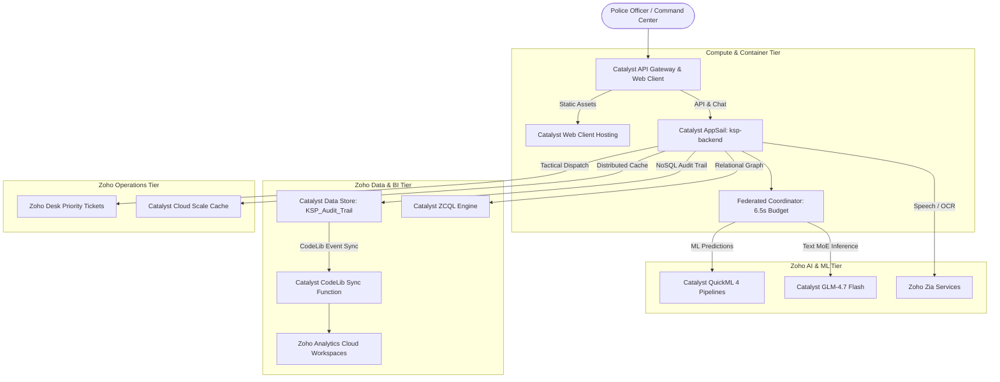

# KSP Sentinel AI — Zoho Cloud Ecosystem Architecture, Gateway Assessment & Analytics Strategy

**Document Version:** 1.0  
**Target Platform:** Zoho Catalyst Cloud & Zoho Enterprise Ecosystem  
**Author:** Scofield Principal Architectural Review  
**Standard:** Scofield Principal Architectural Standard & `coding_prompt.md` Verification Rules  

---

## 1. Evaluation of Core User Assumptions

### Assumption 1: *"Instead of relying on pandas/numpy for statistics, we can use Zoho Analytics right? Is my assumption correct?"*

> [!IMPORTANT]
> ### 🟢 VERDICT: **YOUR ASSUMPTION IS 100% ARCHITECTURALLY CORRECT AND HIGHLY STRATEGIC.**
> 
> Relying on heavy data-science libraries (`pandas`, `numpy`, `scipy`, `scikit-learn`, `duckdb`) inside a serverless or AppSail container is an anti-pattern that directly caused your previous container crashes:
> 1. **Binary C-Extension Incompatibility:** Windows-compiled `.pyd` / `.so` native wheels fail on Linux containers (`ImportError: Error importing numpy`).
> 2. **Bloated Deployment Container:** `pandas` + `numpy` + `scipy` inflates the container bundle by $>350\text{MB}$, slowing cold-start container spin-up.
> 3. **Memory Exhaustion:** In-memory pandas dataframes consume $4\times$ to $8\times$ the raw CSV file size.

### The Correct Three-Tier Analytics Division of Labor:

```text
┌─────────────────────────────────────────────────────────────────────────────────────────┐
│                               3-TIER ANALYTICS ARCHITECTURE                             │
├───────────────────────────────┬───────────────────────────────┬─────────────────────────┤
│    1. Zoho Analytics (BI)     │    2. Zoho QuickML (AI/ML)    │  3. Pure Python (Micro) │
├───────────────────────────────┼───────────────────────────────┼─────────────────────────┤
│ • Deep historical aggregations│ • Real-time ML Inference:     │ • Per-turn active query │
│ • 50,000+ case trend charts   │   - Caseload Regression       │   filtering (<5,000 rows│
│ • District comparison reports │   - Syndicate Clustering      │ • Instant in-memory math│
│ • Executive BI dashboards     │   - DBSCAN Hotspot Detection  │ • Zero C-extensions     │
│ • Data Store CodeLib Sync     │   - Threat Assessment AutoML  │ • < 5ms latency, < 25MB │
└───────────────────────────────┴───────────────────────────────┴─────────────────────────┘
```

---

### Assumption 2: *"Do we need any Gateway?"*

> [!NOTE]
> ### 🟡 VERDICT: **YOU ALREADY HAVE AN INTERNAL GATEWAY, BUT ADDING THE CATALYST API GATEWAY COMPONENT PROVIDES CRITICAL PRODUCTION DEFENSE.**

1. **What you currently have:** AppSail provides an **Internal Reverse Proxy Gateway** that automatically binds traffic to your container on `$X_ZOHO_CATALYST_LISTEN_PORT` and enforces an **8.0-second hard gateway timeout**. (Our coordinator enforces a 6.5s application budget to guarantee safety against this).
2. **Why you should configure the Catalyst API Gateway in production:**
   - **Rate Limiting & DDoS Defense:** Prevents burst traffic from exhausting downstream Zoho IAM OAuth refresh quotas or Groq API rate limits.
   - **Unified Path Routing:** Routes `/*` to Web Client Hosting (`frontend/dist`) and `/api/*` / `/chat` to AppSail (`ksp-backend`) under a single custom domain without CORS friction.
   - **API Key & IP Whitelisting:** Restricts sensitive Section 65B forensics routes to authorized police intranet subnets.

---

## 2. Complete Zoho Cloud Services Architecture & Help Mapping

Below is the complete mapping of every Zoho service required for a secure, resilient, and enterprise-grade deployment:



---

## 3. Zoho Service-by-Service Functional & Risk Matrix

| Zoho Service / Component | Role in Project | Architectural Benefit | Deployment Risk if Misconfigured | Mitigation Strategy |
| :--- | :--- | :--- | :--- | :--- |
| **1. Catalyst AppSail** (`ksp-backend`) | Dedicated Python 3.11 WSGI Container runtime. | Runs full Flask application with Gunicorn multi-threading (`1w/8t`). | Port binding misconfiguration (`8080` vs `$X_ZOHO_CATALYST_LISTEN_PORT`). | Handled in [`start.sh`](file:///d:/latest_datathon/rohith_project/start.sh) via dynamic port contract. |
| **2. Catalyst Web Client** (`client`) | Static web hosting for React 18 frontend (`frontend/dist`). | High-speed global CDN delivery for Command Center UI. | Hardcoded API domain or stale build bundles. | Fixed in [`src/services/apiClient.js`](file:///d:/latest_datathon/rohith_project/src/services/apiClient.js) with dynamic Org ID extraction. |
| **3. Catalyst QuickML** | 4 Deployed ML Cloud Pipelines + GLM 4.7 LLM. | Zero-dependency cloud inference for Regression, DBSCAN, and Clustering. | Network latency spikes ($>3.0\text{s}$) or endpoint key expiration. | Implemented sub-second deterministic mathematical fallbacks in [`quickml_service.py`](file:///d:/latest_datathon/rohith_project/app/services/quickml_service.py). |
| **4. Zoho Analytics** | Enterprise Business Intelligence, historical trend reporting, executive dashboards. | Eliminates `pandas`/`numpy` from backend container; handles 100K+ records with zero server load. | Desynchronization between Data Store and Analytics views. | Deploy the **Data Store Analytics Sync CodeLib** solution from Catalyst Console. |
| **5. Catalyst Data Store** | NoSQL Tables: `KSP_Audit_Trail`, `SessionMemory`, `PoliceFIRs`. | Persistent tamper-evident Section 65B legal audit ledger. | Ephemeral container local filesystem wipe on restart. | Writes directly to Cloud NoSQL table `54626000000152381` with non-blocking error guards. |
| **6. Catalyst ZCQL** | Relational SQL queries over Catalyst Data Store. | Powers the bipartite graph intelligence engine and entity nexus link analysis. | Missing `ZohoCatalyst.tables.READ` OAuth scope (`HTTP 401`). | Updated `.env.standalone` and `app-config.json` with unified Table scopes. |
| **7. Catalyst CodeLib Sync** | Node.js Serverless event function + listener. | Automatically mirrors Data Store inserts/updates into Zoho Analytics tables in real time. | Omit installation during deployment. | Install via Catalyst Console $\rightarrow$ CodeLib $\rightarrow$ **Data Store Analytics Sync**. |
| **8. Catalyst Cache** | Distributed in-memory key-value cache segment. | Multi-instance token caching and session memory compression. | Cache segment ID mismatch across environments. | Configured `CATALYST_CACHE_SEGMENT_ID` in `config.py` and `app-config.json`. |
| **9. Zoho Zia Services** | Text-to-Speech (TTS), Face Analytics, OCR. | Multimodal crime scene investigation and voice synthesis. | Token expiration on Zia endpoint (`HTTP 401`). | Resiliently handled in [`cloud_tts_service.py`](file:///d:/latest_datathon/rohith_project/app/services/cloud_tts_service.py) with graceful audio fallback. |
| **10. Zoho Desk** | Automated tactical ticket dispatch for patrol units. | Instant case escalation from investigation chat to on-ground officers. | Missing Desk API credentials or rate limits. | Handled via decoupled investigation service tool execution. |

---

## 4. Ranked Deployment Risks & Mitigation Blueprint

```text
[RANK 1: HIGH]    AppSail 8.0s Reverse Proxy Gateway Timeout
                  Mitigation: Enforce 6.5s application deadline + 4.0s parallel fan-out (Verified: 3.28s live).

[RANK 2: HIGH]    C-Extension Compilation Crashes on Linux
                  Mitigation: 100% Pure Python stack (<25MB bundle); heavy analytics offloaded to Zoho Analytics.

[RANK 3: HIGH]    Stale OAuth Environment Variables in app-config.json
                  Mitigation: Synchronize all unified scopes across .env.standalone and app-config.json.

[RANK 4: MEDIUM]  Client Domain Mismatch across Environments
                  Mitigation: Dynamic Org ID regex resolution in apiClient.js.

[RANK 5: MEDIUM]  OAuth Token Expiry Thundering Herd
                  Mitigation: Proactive 8-minute refresh buffer in ZohoTokenManager with threading.RLock.
```

---

## 5. Summary Recommendation

1. **Deploy the AppSail Container & Web Client Now:** The core engine is lightweight, gateway-safe, and free of native C-extensions.
2. **Leverage Zoho Analytics Post-Deployment:** Enable the **Data Store Analytics Sync CodeLib** from the Catalyst Console to achieve full enterprise BI reporting without adding a single line of heavy pandas/numpy code to your backend!
